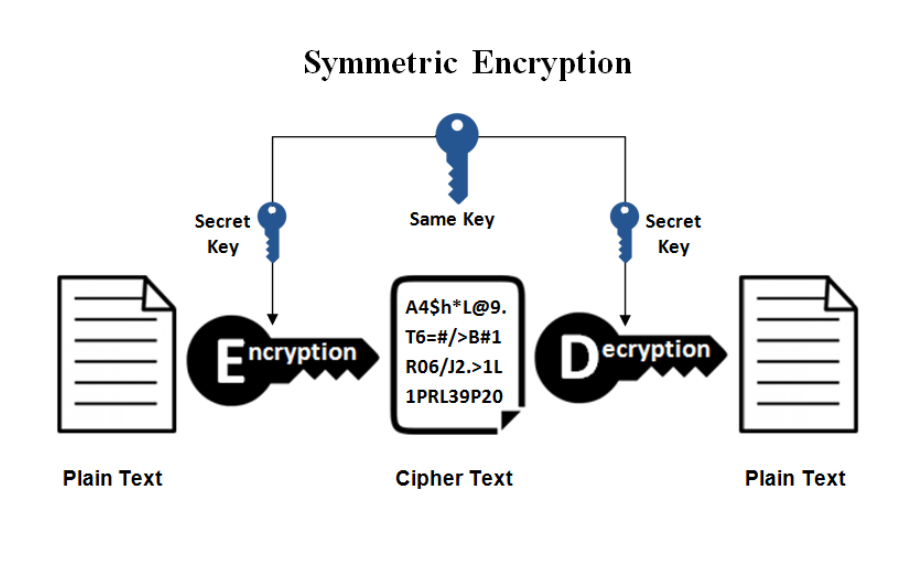

# Local and International Legal Issue

## BUSINESS LICENSES
- Businesses require standard business licenses
- [Get a business license in Alberta](https://www.alberta.ca/get-a-business-licence.aspx)
- [Government of Canada Resources](https://www.alberta.ca/get-a-business-licence.aspx)

## Taxes
- If your business is based in Canada then the [standard business
tax and record-keeping regulations](https://www.canada.ca/en/services/taxes/income-tax/business-or-professional-income.html) apply

## Import/Export Restrictions
Ecommerce businesses are just like any other import/export
business
- Licenses needed
- Regulations & restrictions specify what can and cannot be imported or exported
- Customs fees and duties are involved
  - Need to decide how to pass these to consumer

## Tradmark
Trademark infringements are common
- Microsoft vs. MikeRoweSoft was a legal dispute between Microsoft and a Canadian Grade 12 student named Mike Rowe over the domain name "MikeRoweSoft.com". Microsoft argued that their tradement had been infringed because the words sound the same as Microsoft. A settlement was eventually reached, with Rowe granting ownership of the domain to Microsoft in exchange for an Xbox and additional compensation.

Be careful. Things can go much worse than this.

## Copyright Issues
Be aware of what issues your company might face. Here are some
resources to help.
- [Digital Millennium Copyright Act](https://www.dmca.com/) (DMCA) - US Copyright Law 
- [Digital Rights Management](https://en.wikipedia.org/wiki/Digital_rights_management) (DRM) - Hardware and software protections to prevent copying
- [Electronic Frontier Foundation](https://www.eff.org/) - Working to counteract excessive restrictions and controls
- [Creative Commons](https://creativecommons.org/) - Open licencing for content creators
- [Canadian Copyright Law](https://www.ic.gc.ca/eic/site/cipointernet-internetopic.nsf/eng/h_wr02281.html)

## Patents
Patents protection inventions and software concepts.
- [Patent Information](http://www.ic.gc.ca/eic/site/cipointernet-internetopic.nsf/eng/h_wr00001.html)

## Warrantees/Customer Service/Dispute Resolution
- Policies should be explicitly and clearly explained on website 
  - Possibly get user agreement to terms as part of sale
- Customer support
  - Product support information, specifications, manuals 
  - Community forums
  - Online technical support, Call centers
  - Bug tracking
- Enable easy returns of defective products, repair/replace policy, local repair & warranty service
- Shipping/courier company relationships Vendor/Supplier relationships

## Security
- Since online sales involve financial transactions, security is the most important part of building an Ecommerce site
- Important lessons from Ecommerce history
  - Never store customers’ credit cards on your site
  - Break-in and theft of credit cards becomes a major news story and causes serious legal problems
  - Security is constantly evolving and never guaranteed

## The Four Cornerstones of Security
- Authentication
  - Identity of sender and receiver
- Confidentiality
  - No third party can understand the message
- Non-repudiation
  - Sender cannot claim he or she did not send it afterwards
- Integrity
  - Message contents not altered

## Authentication
- User ID and password most common form of authentication 
  - Passwords must be STRONG
    - 8 characters or longer 
  - Consisting of:
    - Upper and lower case alphabetic characters 
    - Numbers
    - Special characters
  - No dictionary words 
- Other means of identification
  - Biometrics 
  - Personal questions

## Confidentiality
- 3 types of encryption approaches 
  - symmetric key encryption 
  - asymmetric key encryption 
  - one-way hash functions

## Symmetry Key Encryption
- Also called Secret Key Encryption
- Same key used to encrypt and dycrypt data. The key is blended with the message in a particular way.
- Transer of the key is an issue
  - Both the sender and receiver need the same key
  - Should be changed frequently to ensure no "leaks" 
- Faster than asymmetric encryption
- Best for a limited number of users exchanging information

## Asymmetric Key Encryption
- Also called Public Key Encryption 
- 2 keys are needed:
  - Public key - known by everyone (generally used for encryption) 
  - Private key - known only by the owner (generally used for decryption)
- Used a lot for APIs. Keeping the private key hidden and out of repositories is a MUST.

## Trust
Trust is the foundation of Ecommerce
- Must trust the buyer and the seller
- If mutual trust is not implicit, both may trust a 3rd party (Certification Authority like Verisign)
- In Ecommerce, transaction security with encryption is established with SSL
- SSL provides confidentiality, integrity, authentication, and non-repudiation

## Mobile Commerce
- Wireless devices are steadily becoming more powerful and common
- Smartphones and tablets can access online shopping through web browsers and custom applications
- Numerous device configurations make design challenging  -   
  - Different screen sizes, availability of wifi, memory, cameras

Cameras and GPS
More possibilities available than ever before and we're only getting started.
- Barcode scanning
- Product search
- Local availability
- Localized recommendations/reviews

## Demographics
- In many countries, mobile devices are more common than computers
- In younger demographics, mobile devices are also very common

Types of Mobile Products/Services
- Tickets, boarding passes, vouchers, loyalty cards 
- Delivery of content
  - Ringtones, music, movies, ebooks, etc.
  - Integration with electronic stores (iTunes, Android, Amazon, etc.)
- Location-based services
  - Use GPS or IP address location
- Information
  - newspapers, magazines, stock quotes, etc.
- Banking, storefront, brokers, auctions
- Mobile browsing instead of window shopping
- Catalogue purchases - Browse catalog and buy via phone 
- Mobile marketing and advertising

## Mobile Payments
- Banks can link credit cards to cellphone SIM cards
- You can pay with your phone (Apple Pay) or some services apply payment to your phone bill
- Acts as a replacement for cash
- Having a mobile payment option is great for business

## Activity: Assignments 1 & 2
- Work in the groups you selected last week.
- Research which open source shopping carts are available, select which one to try out and install locally on your computer.
- Explore the management and customization options and make some changes to your cart.
