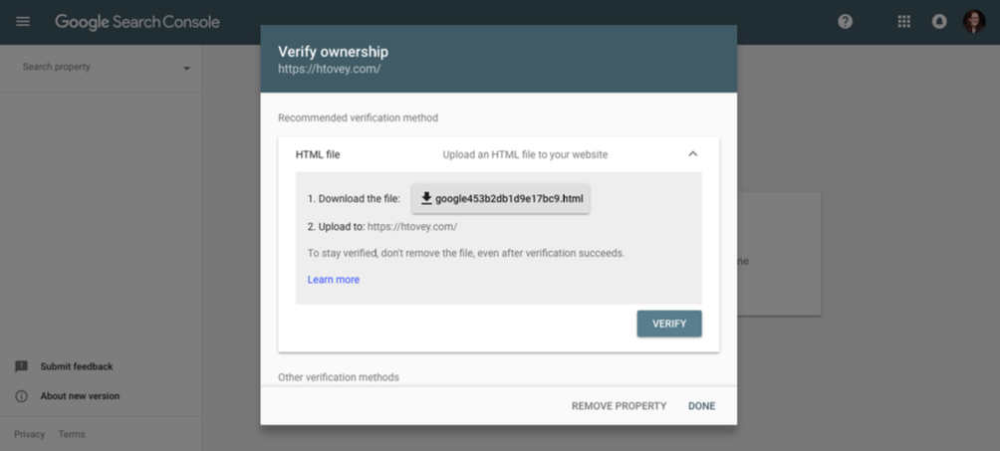
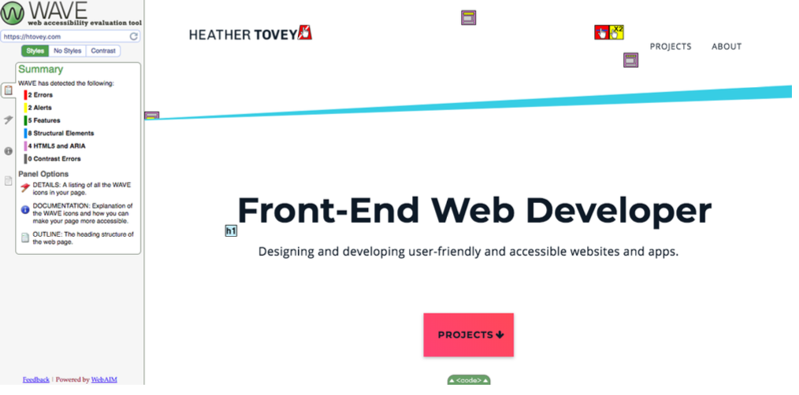
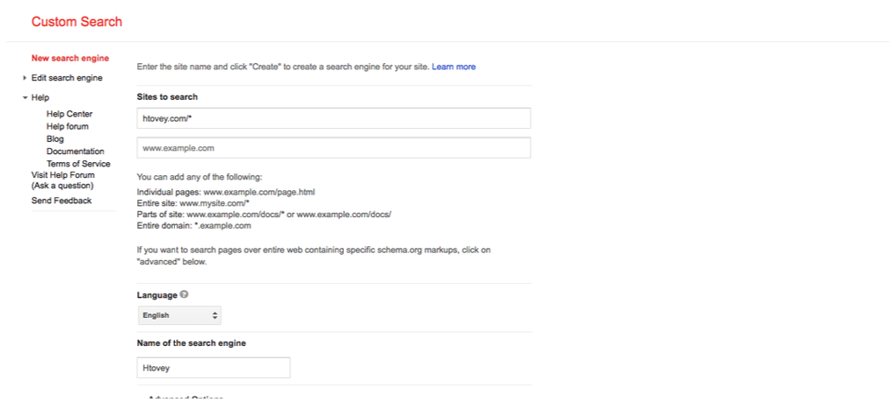
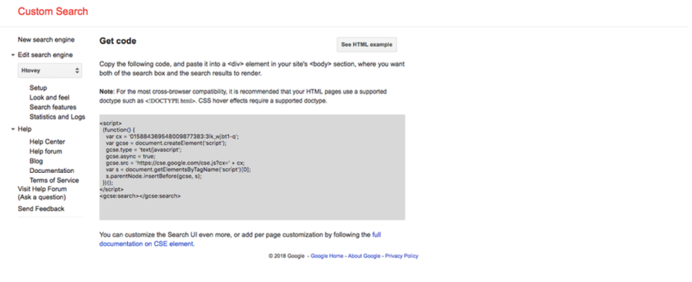
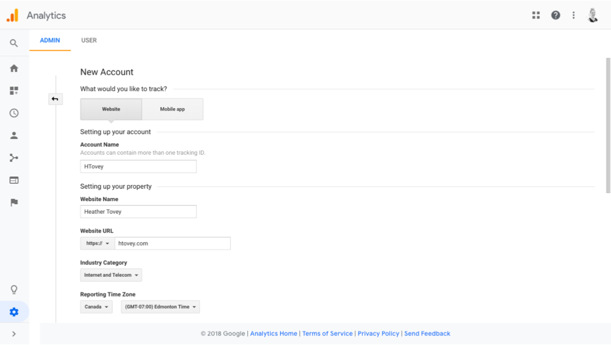
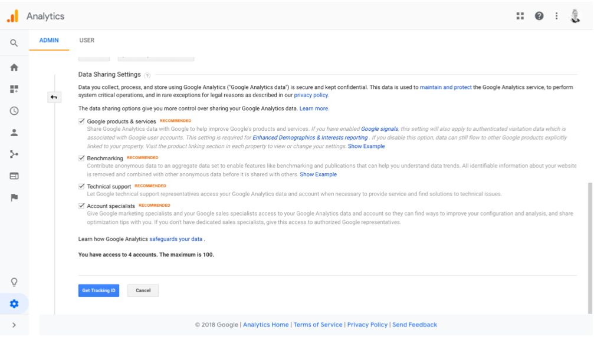

# Add Your Site To Google Search Console

## Relevant Resources
- Article: [Google Search Console: Definitive Guide](https://backlinko.com/google-search-console)

## Add And Verify Your Site
1. Go to https://search.google.com/search-console/welcome
2. Follow the steps to add your site


## Create A Site Map
### Step 1: Know What You're Looking For 
**Which pages should Google know about?**

Home, About, Services - pages you want visitors to find in search pages

**Which pages should Google not know about?**

Login pages, Thank you pages, Author archives on a one-author blog, Admin pages, Internal search results, privacy policy, terms and conditions

## Step 2: Collect Your Pages
Use a crawler like Screaming Frog to give you a list of URLs.

**OR**

Follow each of the site's main navigation options down to their deepest level (human crawl).

## Step 3: Group Your Pages
- Home 
- About 
- Contact 
- Services
  - Design in a Day 
  - SEO
  - Strategy Calls
- Blog
  - How Big of a Website Do You Really Need?
  - Four Considerations If You're Planning a Website Redesign 
  - What Are the Best Alternatives to WordPress?

## Step 4: Code Your Urls 
Open your text editor.
```
<?xml version="1.0" encoding="UTF-8"?>
  <urlset xmlns="http://www.sitemaps.org/schemas/sitemap/0.9">    
    <url>
      <loc>https://example.com/</loc> 
    </url>
    <url> 
      <loc>https://example.com/about/</loc>
    </url> 
    <url>
      <loc>https://example.com/contact/</loc> 
    </url>
    <url>
      <loc>https://example.com/services/</loc>
    </url> 
    <url>
      <loc>https://example.com/design-in-a-day/</loc> 
    </url>
    <url> 
      <loc>https://example.com/seo/</loc>
    </url>
  </urlset>
```
For more info: https://www.sitemaps.org/protocol.html

## Step 5: Validate Your Sitemap 
- Save your file as sitemap.xml
- Validate at https://webmaster.yandex.com/tools/sitemap/?tab=file

## Step 6: Add Your Sitemap To The Root 
Move your sitemap.xml file to the root folder of your website.

## Step 7: Submit Your Sitemap
1. Sign into your Google Search Console account. 
2. Click Sitemaps.
3. Add your sitemap (yoursite.com/sitemap.xml)


# Schema.org - How to structure your data for Google
## Relevant Resources
- [Schema.org](https://schema.org/)

## How to Use Schema.org
Source: [How to use Schema.org to Create and Add Structured Data to Your Website](https://youtu.be/xQeRA-Ojq5c)

1. [Determine your Schema type](https://youtu.be/xQeRA-Ojq5c?t=186)
    - Schema.org: [Getting Started](https://schema.org/docs/gs.html)
2. [Map the elements](https://youtu.be/xQeRA-Ojq5c?t=365)
    - Examples: [Local Business](https://schema.org/LocalBusiness)
    - [Google's Structured Data Guidelines](https://developers.google.com/search/docs/guides/sd-policies)
3. [Choose your approach (JSON-LD)](https://youtu.be/xQeRA-Ojq5c?t=541)
    - [JSON-LD Snippets, Samples and Generator](https://jsonld.com/)
        - Example: [Video content](https://jsonld.com/video/)
4. [Add to site](https://youtu.be/xQeRA-Ojq5c?t=660)
    - [Google Tag Manager](https://tagmanager.google.com/)
5. [Test](https://youtu.be/xQeRA-Ojq5c?t=832)
    - [Google's Structured Data Testing Tool](https://search.google.com/structured-data/testing-tool/u/0/)
6. [Monitor](https://youtu.be/xQeRA-Ojq5c?t=910)
    - [Google Search Console](https://search.google.com/search-console/)

## Validate Your Markup
### Markup Validator Tools 
- HTML Validator - https://validator.w3.org/
- CSS Validator - https://jigsaw.w3.org/css-validator/

## Assess Website Accessibility
### WAVE TOOL
Go to https://wave.webaim.org/ to check the accessibility of your
website.


## ADD A SEARCH ENGINE
### HOW TO ADD A SEARCH ENGINE
- Many CMSs have built-in search engines you can use
- Alternatively, use [Google Custom Search](https://support.google.com/customsearch/answer/4513751)

### STEP 1: ADD YOUR SITE


### Step 2: Determine Look And Feel


### Step 3: Get Code
Add this code on your site where you want the search bar to go.


## Additional Optimization Tips
1. Ensure that each web page has a unique title and keyword focus.
2. Add alt tags to your images.
3. Test all links, multimedia, email, and forms.
4. Test your website on multiple browsers. Make sure everything functions correctly.

## Add Google Analytics
### Step 1: Sign Up
Go to https://analytics.google.com


### Step 2: Create Account


### Step 3: Get Tracking ID


### Step 4: Add Code To Website
Unlike other JS code, this needs to go into the head section of your website.


### Using Google Analytics
Use Google Analytics to help you figure out where visitors are
coming from and how they interact with your site.
1. What is your top content?
2. Identify your worst performing pages (so you can fix them).
3. Where do visitors abandon shopping carts?
4. Are mobile users staying on your site long enough?
5. What do visitors click on the most?
6. What online campaigns send more visitors your way?

### GOOGLE ANALYTICS TIPS
- It takes a while before trends start to show, so get Analytics on your website ASAP.
- [Take the free Analytics courses with Google](https://analytics.google.com/analytics/academy/)

## Google Adwords
### Paid Search Advertising
- There are over 3.5 billion search queries on Google everyday. 
- Paid search is one of the most popular and effective types of online advertising.

Source: http://www.internetlivestats.com/google-search-statistics/
 
### Using Paid Search Advertising
- Google Adwords lets you display ads on Google search results 
- Businesses set a budget for advertising on the keywords that they choose, and pay when people click on their ad. (Pay Per Click or PPC)
- Fewer than 20% of visitors click on PPC ads
- Businesses with large advertising budgets can dominate the top placement of ads
- It can be very expensive.

SEO > Online Ads when you're starting out

### GOOGLE ADWORDS TRAINING
If you find that this is an area of web services that you want to
pursue, Google offers Adword training for free.

https://landing.google.com/academyforads

## Add A Newsletter
### WHY YOU SHOULD HAVE A MAILING LIST
- Keeps you in contact with your customers on a regular basis 
- Builds repeat traffic to your site
- Potential source of revenue, allowing you to market directly to your target audience
- Builds a client list of potential customers for future sales and promotions

### Get Permission
- Businesses that build permission-based email lists enjoy high open and click-through rates on their campaigns.
- You need to get consent before sending commercial email marketing messages.
- Don't just send advertisements. Send content of real value to them.

### Implied Vs Express Permission
You have **implied permission** to email someone if you have an
existing business relationship with them.
- current customer
- they donate to your charity
- active member of your organization

You have **express permission** to email someone when they specifically give you permission to send them email campaigns.
- entering their email address on your subscribe form 
- entering their details into in-store newsletter subscribe form

### BENEFITS OF GETTING PERMISSION
1. You'll get better open and click-through rates (10x higher)
2. You'll get a better return on investment from your email
campaigns
3. You won't destroy your deliverability rates (don't get your emails thrown into SPAM jail)

## GOOGLE MAPS
### TYPES OF GOOGLE MAPS
- Google Maps Embed API 
- Google Static Maps API 
- Google Maps JavaScript API

### Embedded Maps
- Creates a map that can be interacted with through an iframe on your website
- Easily embedded, simple copy and pasting of code
- If your website visitors are also logged into Google, they'll see their saved places like "Home" or "Work" integrated into the map.
- API Key not required

### Static Maps
- Creates a static map (an image) without any JavaScript or iframe required
- Loaded like any other image
- Not interactive or tailored to the user
- Can be customized 
- API key required

### Javascript Maps
- Covers a wider range of map usage
- Helps visualize data
- Requires knowledge of HTML, CSS, and JavaScript 
- API key is required

### Static Map Maker
For a static map, you can use tools like:
- [Google Static Map Maker](https://staticmapmaker.com/google/)
- [Google Maps APIs Styling Wizard](https://mapstyle.withgoogle.com/)
- Import styles from https://snazzymaps.com/
211

## Add A Social Bookmarking Widget

Source: https://www.buzzfeed.com/lyapalater/how-is-this-pic-of-chris-evans-taking-a-selfie-with-his-dog
 
### Install Add This
1. Go to https://www.addthis.com/
2. Sign up for an account
3. Choose and customize social bookmarks 
4. Get the code to install

## Evaluate Your Website
### What Does Success Mean?
- Increasing the number of visitors
- More visitors signing up for your newsletter
- Visitors staying on the site longer
- Higher website ranking
- Increase in sales of specific products or services
- Increase in customer conversion rate
- Increased number of returning visitors
- Reduction in the amount of phone support required to support a product
- Increased brand awareness
- Improved customer communication and awareness
- Increase in the number of employees applying for jobs

### Success
- You won't see success right away. But you can track it over time with analytics.
- Analytics won't tell you why someone left your website or why something is failing.

## Testing Website Usability
### Test Your Site On Real People
- Use analytics to tell you what your problem pages are. 
- Get help from 3-5 people
- Ask questions
- Take the feedback and use it find solutions

### Example Questions To Ask
1. Does the overall look of our home page support our position as a mid- to high-range provider?
2. Is the home page too "busy?”
3. Would a visitor rather search by using the search engine on the top left-hand side or navigate a tour page? Why?
4. Is the navigation from the home page easy to understand?
5. What is the worst thing on the home page?
6. What aspect of the site confused you?

### Activity: Usability Check
Go To https://stayintech.com/UX and use the Usability Checklist to take a look through your website (or website of your choice). 

Get a feel for what things you should be looking for.

## Getting Feedback From Your Visitors
### Ways To Get Feedback
- Give surveys to your visitors and people on your mailing list - Read blog comments
- Encourage your mailing list to reply back with problems they're having
- Keep track of technical support issues and pay attention to patterns

### Tips For Creating Surveys
- Keep them short.
- Online form abandonment is at about 40%.
- Offer a reward or discount for finishing the survey.
- Keep in mind that not everyone tells the truth, so stick with questions that aren't too personal if you can.