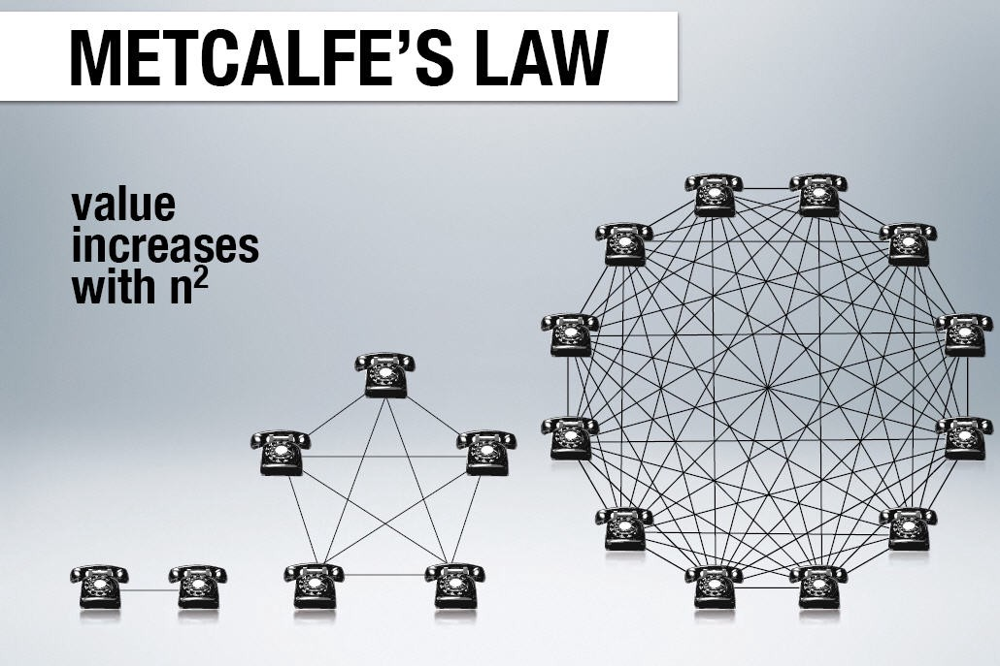
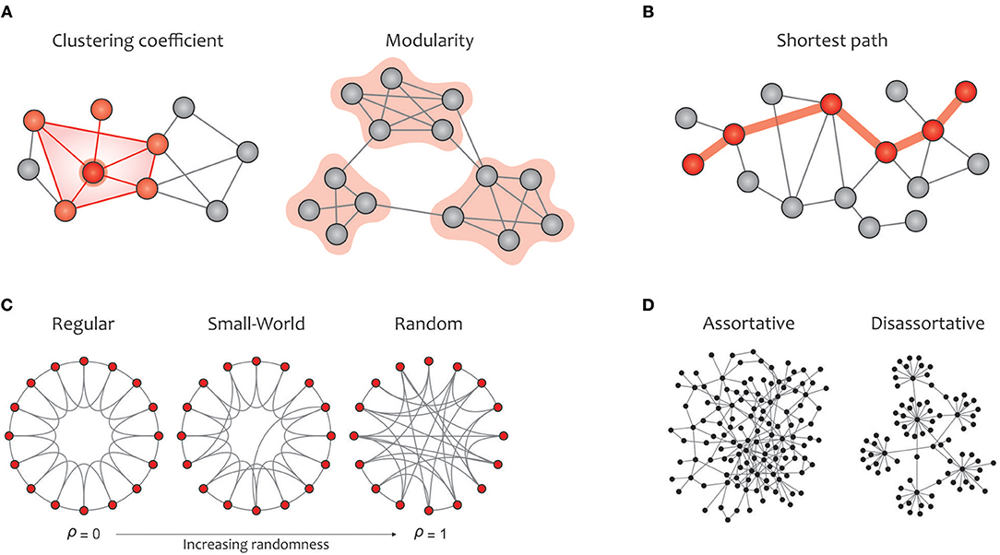

# DSGN 270 Chapter 0: Social Networking Theory
## Housekeeping
- [Social Media Assignment breakdown](../../assignments/README.md)

## Relevant Resources
- [Most Popular Social Networks 2003-2019](https://youtu.be/aOymOiQdNaE)
- [UK Social Media Statistics 2019](https://youtu.be/lEzRHa5hQFA)
- [Social Media Usage Statistics for 2019 Reveal Surprising Shifts](https://www.convinceandconvert.com/social-media-research/social-media-usage-statistics/)

## Social Networking Theory
### Terminology
- Node: individual actors, people, or things within the network.
- Connection: relationships or interactions that connect nodes. Also called ties, edges, or links.
- Homophily: the natural tendency for people to interact with others who are similar to themselves based on almost any dimension. 
  - Induced Homophily: groups created as a result of outside forces such as age, socioeconomic status.
  - Choice Homophily: individuals will find others similar to themselves regardless of the group setting.
  - Examples of homophily from Cifford Nass (*The Man Who Lied to His Laptop*, 2010)
    - When people find a lost wallet, they are more likely to hand it in to lost and found if the owner's name is similar to their own.
    - Two people are more likely to marry when their first names are similar.
    - A test subject is more willing to accept criticism from a computer that is the same colour as their wristband.

### Network Growth
Metcalf's Law states that "the effect of a telecommunications network is proportional to the square of the number of connected users of the system (n2)"

Figure 1: Connections grow exponentially with network size ([Source](https://medium.com/@embrkbusiness/knowledge-and-metcalfes-law-f0bc13a33db3))

### Cognitive Load
Dunbar's number is a suggested cognitive limit to the number of people with whom one can maintain stable social relationships—relationships in which an individual knows who each person is and how each person relates to every other person. [source](https://en.wikipedia.org/wiki/Dunbar%27s_number)

This concept is often called the Monkey Sphere (first referenced by David Wong, editor of cracked.com). [source](https://www.cracked.com/article_14990_what-monkeysphere.html)

### Social Network Analysis
Social network analysis studies the human social patterns in a world where we have limited cognitive resources for maintain social ties. Studies show that a few people account for a disproportionate amount of the connectivity. These "connectors" maintain many weak ties to a larger collection of tighter groups with stronger ties.

This is the basis of the [Six Degrees of Separation](https://en.wikipedia.org/wiki/Six_degrees_of_separation)

See: [Strong and Weak Ties: Why Your Weak Ties Matter](https://www.socialmediatoday.com/content/strong-and-weak-ties-why-your-weak-ties-matter).

Figure 2: Graph Theory Clusters ([Source](https://sciences.ucf.edu/psychology/lighthalllab/dr-lighthall-contributes-to-new-systematic-review-of-graph-theory/))

### Breakout: Six Degrees of WBDV
Using a social media network of your choice, analyze your connections.
  - Start with the profiles that have the most connections. How do you know each these people? 
  - Does anyone have shared connections to other member of your breakout group? Is anyone connected to all of you?
    - How well do each of you all know this person?
    - Do you all have a common interest? Think "homophily".
    - Are these mostly real life or online interactions?
  - What connections are from sharing an obsure interest?

Choose one or more members of your group to take lead in summarizing your findings for the rest of the class. There will be a group discussion after the breakout sessions.

Don't forget your team name!

## Afternoon Guest: Daorcey LeBray
